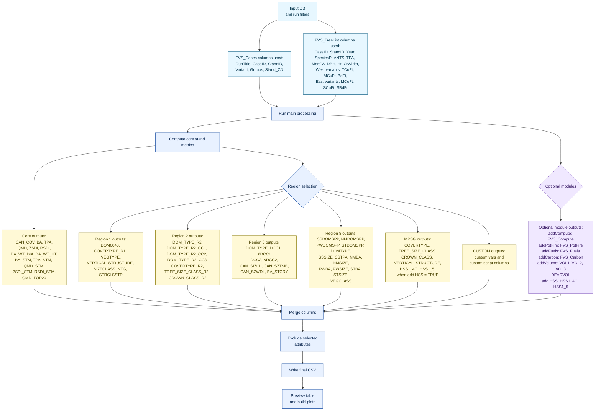

# VegClass2.0
This package provides a suite of functions that are used to derive vegetation classifications from Forest Vegetation Simulator output. 

## Overview
VegClass2.0 is an R package for converting Forest Vegetation Simulator (FVS) output into stand-level vegetation classification and summary attributes. It reads FVS database output, processes each stand or case, and calculates a standard set of vegetation metrics such as basal area, trees per acre, quadratic mean diameter, canopy cover, and size/density measures.

The package supports multiple regional rule sets, including Regions 1, 2, 3, and 8, as well as MPSG workflows. It can also add optional outputs such as HSS, compute variables, potential fire metrics, fuels, carbon, and volume measures when the required database tables are available.

VegClass2.0 is designed to run on single databases or in parallel across many stands, producing a combined CSV output that can be used for reporting, analysis, or downstream processing. Custom variables and custom output scripts can also be included to support project-specific workflows.

## High-level workflow

